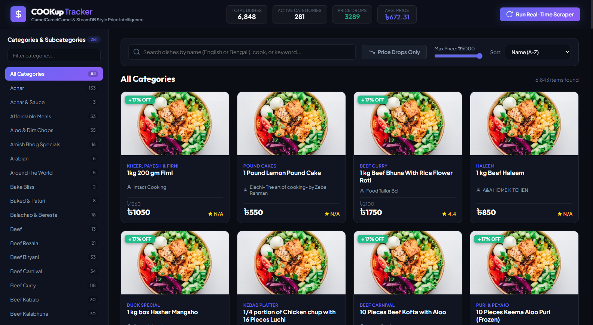
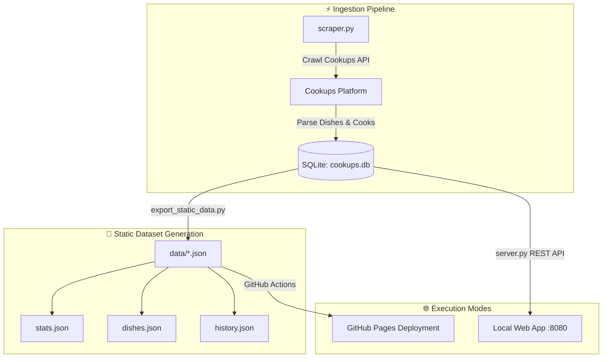

# 🍳 COOKup Analytics — Home-Cooked Food Price Tracker

> **Artisanal Food Telemetry, Home Cook Analytics & Dish Price History Platform for Cookups Bangladesh.**

[](https://ranehal.github.io/COOKup-analytics/)
[](https://www.python.org/)
[](https://www.sqlite.org/)
[](LICENSE)

---

## 📌 Executive Summary

**COOKup Analytics** is an interactive telemetry and price analytics platform built for [Cookups](https://cookups.com.bd), Bangladesh's premier marketplace for home-cooked meals and artisanal dishes.

The system ingests dish catalogs, tracks pricing fluctuations across home cooks, calculates price drop trends, and provides interactive modal analytics. Built on a hybrid architecture, COOKup Analytics operates seamlessly via a local Python REST API server or statically through pre-baked JSON datasets deployed to GitHub Pages.

---

## 🚀 Key Features

- **👨‍🍳 Cook & Dish Telemetry**: Track active home cooks, dish availability, category distribution, and average dish pricing metrics.
- **📉 Dynamic Price Drop Tracker**: Dedicated filter highlighting active price reductions across home-cooked meals.
- **📊 Interactive Chart.js Modals**: Detailed price history charts displaying price trends over time per dish.
- **⚡ Hybrid Architecture**: Runs as a dynamic HTTP REST API service ([`server.py`](file:///C:/PROJECTS/COOKup/server.py)) or as a static site backed by exported JSON datasets ([`export_static_data.py`](file:///C:/PROJECTS/COOKup/export_static_data.py)).
- **💾 Relational SQLite Database**: Structured storage (`cookups.db`) maintaining dishes, categories, cooks, and daily price logs.

---

## 📸 Screenshots

> Captured from a live localhost run of the dashboard.

| Dashboard |
| :---: |
|  |

---

## 🏗️ System Architecture



---

## 📁 Repository Structure

```
COOKup/
├── scraper.py              # API crawler and SQLite database populator
├── server.py               # Python HTTP server & REST API handler (:8080)
├── export_static_data.py   # Exporter script generating static JSON datasets
├── cookups.db              # SQLite database (dishes, cooks, categories, price history)
├── app.js                  # Frontend interactive SPA (dual REST API / static fallback)
├── index.html              # Responsive dashboard markup
├── style.css               # Modern dashboard layout styling
├── data/                   # Pre-baked static JSON files for GitHub Pages
│   ├── stats.json          # Overall platform statistics summary
│   ├── categories.json     # Category breakdown map
│   ├── dishes.json         # Dish records lookup
│   └── history.json        # Historical price change logs
└── .github/workflows/
    └── deploy.yml          # GitHub Pages automated deployment workflow
```

---

## 🛠️ Usage & Local Setup

### 1. Local Server Mode (Dynamic REST API)
To launch the backend API server and web interface:
```bash
python server.py
```
Open `http://localhost:8080` in your web browser.

### 2. Updating Static Data for GitHub Pages
To crawl fresh data and update SQLite database:
```bash
python scraper.py
```
To export updated database records into static JSON datasets:
```bash
python export_static_data.py
```

---

## 🚀 Future Work — Production-Grade Roadmap

The following roadmap outlines the engineering steps required to evolve **COOKup Analytics** from a local/research tool into a polished, industrial-grade product:

### 1. Architecture & Infrastructure
- **Containerization & Orchestration**: Package scraper + API server + dashboard as Docker images; deploy with `docker-compose` locally and Kubernetes (EKS/GKE) for horizontal scaling.
- **Managed Databases**: Migrate from the local `cookups.db` SQLite file to a managed PostgreSQL (RDS/Cloud SQL) with partitioning for daily price snapshots and connection pooling (PgBouncer).
- **Production Web Framework**: Replace the stdlib `http.server` backend with a production-grade ASGI framework (FastAPI) with typed endpoints, OpenAPI docs, and async DB drivers.
- **Broker-Backed Ingestion**: Replace in-process scraping with a resilient pipeline using Redis Streams / Kafka with retries, dead-letter queues, and resumable checkpoints.
- **Object Storage + CDN**: Store dish images and raw daily snapshots in S3/Cloudflare R2 with a CDN; enforce lifecycle policies for archival.
- **Caching Layer**: Redis for hot queries (stats, categories, dishes) with TTL invalidation; ETag/If-Modified-Since on all API responses.

### 2. Reliability & Observability
- **Structured Logging & Tracing**: JSON structured logging with correlated request IDs and OpenTelemetry tracing across scraper → queue → DB → API.
- **Metrics & Alerting**: Prometheus metrics (scrape success rate, latency percentiles, job durations) + Grafana dashboards + PagerDuty/AlertManager alerts.
- **SLOs & Health Checks**: `/health`, `/ready` endpoints; scraper watchdog that auto-recovers from stuck sessions; idempotent job resumption.
- **Automated Testing**: Unit tests for API parsing and delta compression; integration tests with recorded fixtures; end-to-end Playwright tests for the dashboard.

### 3. Security & Compliance
- **Secret Management**: Move all credentials into a vault (AWS Secrets Manager / HashiCorp Vault / Doppler) — never baked into images or repos.
- **Auth & Rate Limiting**: API-key/JWT-based access control with per-tenant rate limiting; TLS everywhere; dependency scanning (Snyk/Dependabot) and SBOM generation.
- **Respectful Crawling**: robots.txt compliance, domain-wide polite rate limiting, exponential backoff, and traffic shaping to avoid impacting the upstream service.

### 4. Data Platform & Analytics
- **Warehouse & BI**: Land normalized datasets into a columnar warehouse (ClickHouse/BigQuery) with dbt transformations; build Looker/Metabase dashboards.
- **Streaming Prices**: Migrate daily batch snapshots to near-real-time streaming (Kafka → Flink/Spark) for live price movement detection.
- **ML / Forecasting**: Add time-series forecasting (Prophet/ARIMA/LightGBM) for price prediction, anomaly detection on drops, and personalized dish recommendations.

### 5. Product & UX
- **User Accounts & Sync**: OAuth2 accounts, cross-device watchlists/alerts, and email/push notifications (SendGrid/FCM) when target prices are hit.
- **Public API & Docs**: Versioned, documented public REST API (OpenAPI) with rate limits and developer keys; optional GraphQL gateway.
- **Localization & Accessibility**: Full i18n (bn/en), WCAG 2.1 AA compliance, dark/light theming consistency, and mobile-first responsive PWA with offline mode.
- **Performance Budget**: Code-splitting, virtualized product lists, lazy-loaded charts, and Lighthouse budgets enforced in CI (CLS < 0.1, LCP < 2.5s).

---

## 📜 License

Distributed under the MIT License. Data rights belong to Cookups. Built for analytical and personal tracking purposes.
