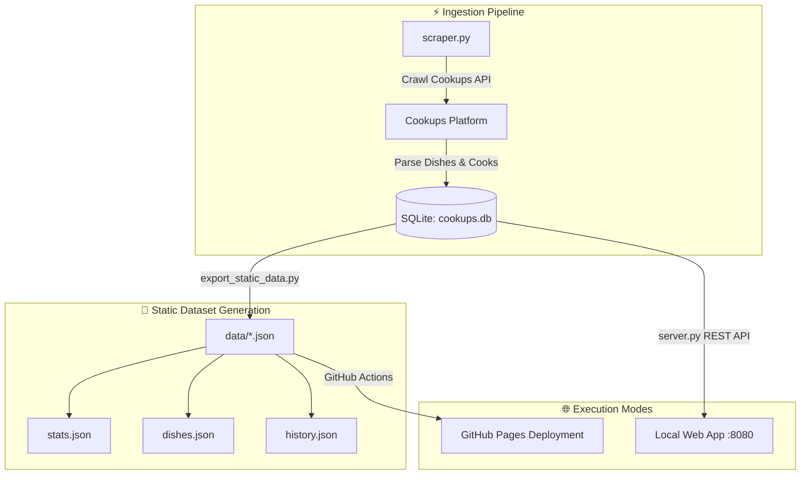

# 🍳 COOKup Analytics — Home-Cooked Food Price Tracker

> **Artisanal Food Telemetry, Home Cook Analytics & Dish Price History Platform for Cookups Bangladesh.**

[](https://ranehal.github.io/COOKup-analytics/)
[](https://www.python.org/)
[](https://www.sqlite.org/)
[](LICENSE)

---

## 📌 Executive Summary

**COOKup Analytics** is an interactive telemetry and price analytics platform built for [Cookups](https://cookups.com.bd), Bangladesh's premier marketplace for home-cooked meals and artisanal dishes.

The system ingests dish catalogs, tracks pricing fluctuations across home cooks, calculates price drop trends, and provides interactive modal analytics. Built on a hybrid architecture, COOKup Analytics operates seamlessly via a local Python REST API server or statically through pre-baked JSON datasets deployed to GitHub Pages.

---

## 🚀 Key Features

- **👨‍🍳 Cook & Dish Telemetry**: Track active home cooks, dish availability, category distribution, and average dish pricing metrics.
- **📉 Dynamic Price Drop Tracker**: Dedicated filter highlighting active price reductions across home-cooked meals.
- **📊 Interactive Chart.js Modals**: Detailed price history charts displaying price trends over time per dish.
- **⚡ Hybrid Architecture**: Runs as a dynamic HTTP REST API service ([`server.py`](file:///C:/PROJECTS/COOKup/server.py)) or as a static site backed by exported JSON datasets ([`export_static_data.py`](file:///C:/PROJECTS/COOKup/export_static_data.py)).
- **💾 Relational SQLite Database**: Structured storage (`cookups.db`) maintaining dishes, categories, cooks, and daily price logs.

---

## 🏗️ System Architecture



---

## 📁 Repository Structure

```
COOKup/
├── scraper.py              # API crawler and SQLite database populator
├── server.py               # Python HTTP server & REST API handler (:8080)
├── export_static_data.py   # Exporter script generating static JSON datasets
├── cookups.db              # SQLite database (dishes, cooks, categories, price history)
├── app.js                  # Frontend interactive SPA (dual REST API / static fallback)
├── index.html              # Responsive dashboard markup
├── style.css               # Modern dashboard layout styling
├── data/                   # Pre-baked static JSON files for GitHub Pages
│   ├── stats.json          # Overall platform statistics summary
│   ├── categories.json     # Category breakdown map
│   ├── dishes.json         # Dish records lookup
│   └── history.json        # Historical price change logs
└── .github/workflows/
    └── deploy.yml          # GitHub Pages automated deployment workflow
```

---

## 🛠️ Usage & Local Setup

### 1. Local Server Mode (Dynamic REST API)
To launch the backend API server and web interface:
```bash
python server.py
```
Open `http://localhost:8080` in your web browser.

### 2. Updating Static Data for GitHub Pages
To crawl fresh data and update SQLite database:
```bash
python scraper.py
```
To export updated database records into static JSON datasets:
```bash
python export_static_data.py
```

---

## 📜 License

Distributed under the MIT License. Data rights belong to Cookups. Built for analytical and personal tracking purposes.
